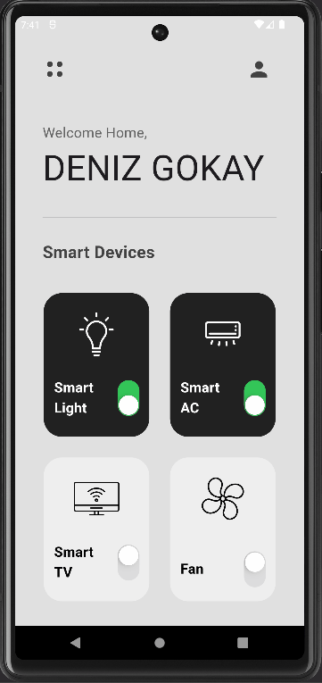

# FlutterProjects
This GitHub repository serves as a showcase for various Flutter projects I've constructed, drawing inspiration from diverse youtube videos.

"To provide context and acknowledge the inspiration behind each project, detailed information can be found within the individual project's README file."

# All Projects
- ### SmartHomeUI

  

#

- ### TicTacToe

  

#

- ### GeminiMath

  

#

- ### CoffeeUI

  

#

- ### MyToDos

  

#

- ### IWantToEat

  

#

- ### BurgerWebUI

  

#

- ### BMICalculator

  

#

- ### CalculatorUI

  

